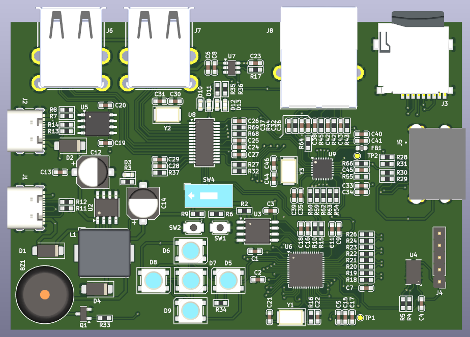

# RP2040 Development Board

This is a custom development board based on the Raspberry Pi RP2040 microcontroller. It integrates essential peripherals for embedded systems prototyping, including USB, Ethernet, RGB LEDs, sensors, and storage. The design is accompanied by validated firmware that supports all core hardware features.

---

## 🧩 Features

- **Microcontroller**: Raspberry Pi RP2040 (dual-core ARM Cortex-M0+)
- **Power Management**:
  - XL1509-3.3 Buck Converter
  - CH217K USB Power Switch
- **USB Interface**:
  - CH340N USB-to-Serial
  - Dual USB ports for host and device roles
- **Networking**:
  - LAN8720A Ethernet PHY (RMII)
  - RJ45 connector (HR911105A)
- **Storage**:
  - MicroSD card 
  - W25Q128FV QSPI Flash
- **Sensors**:
  - ADXL345 3-Axis Accelerometer (I²C/SPI configurable)
- **User Interface**:
  - Daisy-chained WS2812-compatible RGB LEDs
  - Onboard buzzer
  - Status LEDs (Ethernet activity)
- **Debugging**:
  - SWD interface
  - USB bootloader support
- **Expansion**:
  - HDMI-style connector (repurposed for GPIO)
  - Multiple GPIO headers and DIP switches

---

## ✅ Firmware Validation

The firmware has been **fully validated** and supports all major board features.  
*(Please check with Arduino and Pico SDK examples)*

The firmware has been fully validated and supports all major board features:

- [x] **USB Host/Device** – Detection and communication
- [x] **Ethernet** – Connectivity via LAN8720A
- [x] **MicroSD** – FAT filesystem read/write
- [x] **RGB LEDs** – WS2812-compatible LED control
- [x] **ADXL345** – Sensor readout over I²C
- [x] **QSPI Flash** – W25Q128FV access
- [x] **Buzzer & GPIO** – Output control and signal handling
- [x] **HDMI** - Digital video signal rendering tested
- [x] **Bootloader & SWD** – Debugging and firmware upload

© 2025 – RP2040 Dev Board Project. All rights reserved.

